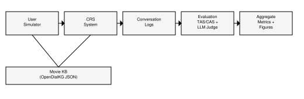
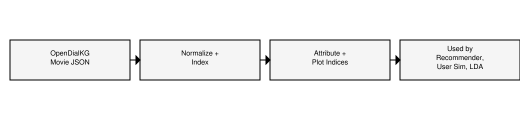
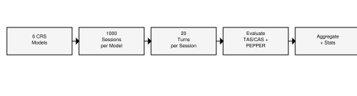
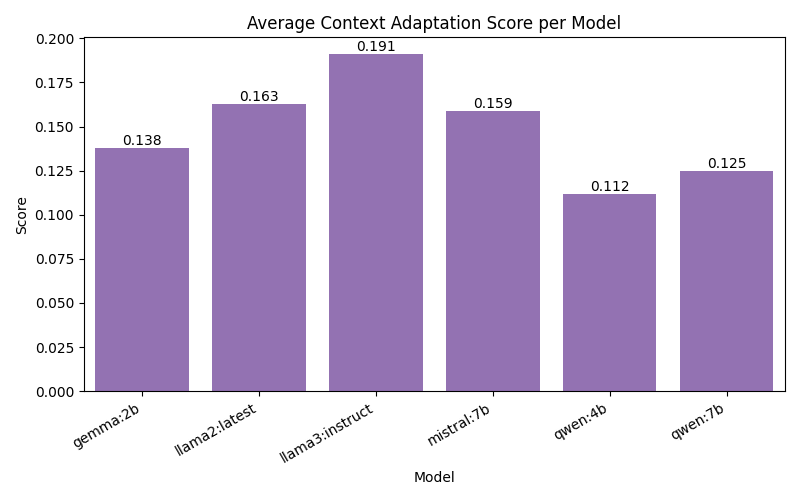
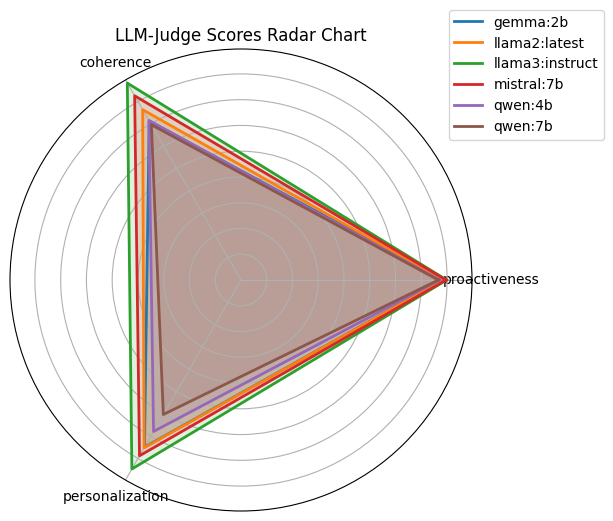
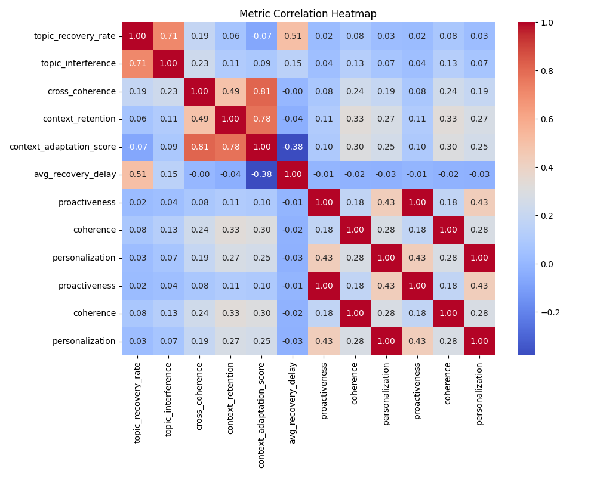

# Preference Shift Evaluation in Conversational Recommender Systems

## Proposed Approach
### System overview
This system evaluates how a conversational recommender system (CRS) adapts to user preference shifts over a multi-turn dialogue. A user simulator generates preference-seeking utterances with explicit shifts and contradictions. The CRS uses rule-based constraint extraction to retrieve candidate movies and then uses an LLM for response generation. The resulting conversation is evaluated by a topic-shift-aware metric (TAS/CAS) and a PEPPER-style LLM judge. Aggregate statistics and visualizations are produced across models.



### Algorithm 1: End-to-end evaluation pipeline
```text
Input: movie KB, CRS model list, user simulator model, judge model
Output: per-session metrics, model summaries, figures

1. Load and index movie KB (genres, attributes, plot keywords).
2. For each CRS model m in the experiment list:
   2.1 For each session s in 1..N:
       a) Initialize UserSimulator and CRSSystem(m).
       b) For t in 1..20 turns:
          i) UserSimulator emits user message u_t.
         ii) CRSSystem updates constraints and returns response s_t.
        iii) Log (u_t, s_t) and update user simulator state.
       c) Evaluate conversation: segment user topics, compute TAS/CAS, run LLM judge.
       d) Write per-session result to results.jsonl.
3. Aggregate results across sessions and models into model_metrics.csv.
4. Generate plots and statistical tests.
```

### CRS component
The CRS uses rule-based extraction to update constraints from user utterances. Genre cues are matched against known genres, year is extracted with regex, and attribute values are matched against the dataset indexes (actor, director, language, writer, name). Plot keywords are extracted using a domain-specific keyword index. Based on the current constraints, candidate movies are retrieved from the dataset and supplied to the LLM as a short list. The LLM is only used to generate the final conversational response, not to parse constraints.

### User simulator
The simulator is a rule-based agent that generates preference-seeking utterances and explicit shifts. It rotates through asking about actors, themes, and mood, and periodically changes genre or attributes such as year, actor, director, language, writer, or plot. It can also emit contradictions to model realistic preference uncertainty. The simulator tracks system responses to choose follow-up questions and can optionally use an LLM to produce drifted utterances. This setup induces frequent topic shifts to stress-test adaptation.

### LLM scorer (PEPPER-style)
An LLM judge scores three qualitative metrics on a 1 to 5 scale: proactiveness, coherence, and personalization. The judge receives the full conversation and a short summary of user preferences extracted from user turns. These scores complement TAS/CAS by capturing conversational quality and perceived alignment.

### Topic Adaptation Score (TAS) / Context Adaptation Score (CAS)
The core metric is implemented as CAS in code, but it is presented as TAS in the thesis. TAS combines cross-coherence, context retention, recovery rate, recovery delay, and topic interference. Topic shifts are detected from user turns using embedding similarity and topic keyword overlap.

```text
cross_coherence = (1/N) * sum_i sim(u_i, s_i)
context_retention = (1/(M-1)) * sum_i sim(s_{i-1}, s_i)

Topic shift detection:
- shift if sim(prev_text, curr_text) < SIM_TOPIC_SHIFT
  or jaccard(prev_topics, curr_topics) < TOPIC_JACCARD_SHIFT

topic_recovery_rate = recovered_shifts / total_shifts
avg_recovery_delay = mean(recovery_delay over recovered shifts)

interference per shift = leakage_hits / denom
topic_interference = mean(interference per shift)

Normalization (range 1..6 for delay):
rd_norm = 1 - clamp((avg_recovery_delay - 1) / 5)
ti_norm = 1 - clamp(topic_interference)

TAS = sum_k (w_k * v_k) / sum_k (w_k)
where v_k in {topic_recovery_rate, rd_norm, ti_norm, cross_coherence, context_retention}
```

The implementation uses sentence-transformer embeddings when enabled; otherwise, it falls back to TF-IDF similarity. Topic extraction uses LDA by default, with LLM or heuristic fallback options.

## Dataset
The system uses an existing movie knowledge base derived from OpenDialKG in `opendialkg_movie_data.json`. No new dataset is created. Each movie includes fields such as name, genre, year, actor, director, language, writer, and plot.



Preprocessing steps include: (1) normalization of genre strings, (2) indexing of attribute values to enable fast constraint lookup, and (3) extraction of plot keywords for shallow semantic matching. The dataset supports three roles: recommendation retrieval in the CRS, attribute pools for the user simulator, and LDA training for topic extraction.

Fallbacks and checks: if pre-trained LDA files are missing, topic extraction falls back to a keyword heuristic. If transformer embeddings are unavailable, the metric uses TF-IDF vectors. Limitations include noisy genre labels and duplicate metadata entries, which can blur topic boundaries and reduce interpretability.

## Experiments
The experiments evaluate six CRS models with fixed user and judge settings. Each model is run for 1000 sessions and 20 turns per session. The session counts found in results.jsonl are: gemma:2b=1000, llama2:latest=1000, llama3:instruct=1000, mistral:7b=1000, qwen:4b=1000, qwen:7b=1000. The average detected number of topic shifts per session is 18.87, indicating frequent user preference changes.



Key settings:
- CRS models: gemma:2b, qwen:7b, qwen:4b, llama3:instruct, llama2:latest, mistral:7b.
- User simulator model: llama3:instruct.
- LLM judge model: llama3:instruct.
- Topic extractor mode: lda (default in config; can be llm or heuristic).
- Embedding backend: TF-IDF by default, sentence-transformer optional.
- Thresholds: SIM_TOPIC_SHIFT=0.55, TOPIC_JACCARD_SHIFT=0.35, ALIGNMENT_THRESHOLD=0.65.

Reported metrics:
- TAS/CAS components: topic_recovery_rate, avg_recovery_delay, topic_interference, cross_coherence, context_retention, and the weighted aggregate score.
- PEPPER-style metrics: proactiveness, coherence, personalization.
- Statistical testing: ANOVA with Tukey HSD post-hoc analysis.

## Results and Discussion
Overall, llama3:instruct leads the aggregate TAS/CAS score and all three PEPPER-style metrics, indicating strong alignment and conversational quality. Mistral:7b shows the best recovery rate, while qwen:7b shows the fastest average recovery. Gemma:2b has the lowest topic interference but weaker coherence and retention.

Top metrics from model_metrics.csv:
- Best TAS/CAS: llama3:instruct (0.189) then mistral:7b (0.159)
- Best recovery rate: mistral:7b (0.258) then llama2:latest (0.245)
- Fastest recovery (lower is better): qwen:7b (4.249) then mistral:7b (4.285)
- Lowest interference (lower is better): gemma:2b (0.075) then llama3:instruct (0.096)
- Highest cross-coherence: llama3:instruct (0.114) then mistral:7b (0.100)
- Highest context retention: llama3:instruct (0.213) then llama2:latest (0.192)
- Best proactiveness (LLM judge): llama3:instruct (3.994) then mistral:7b (3.985)
- Best coherence (LLM judge): llama3:instruct (4.329) then mistral:7b (4.205)
- Best personalization (LLM judge): llama3:instruct (4.277) then mistral:7b (3.964)







Tradeoffs are visible across models. Higher recovery rate does not guarantee higher cross-coherence or retention, and low interference alone does not yield the top TAS/CAS score. The correlation heatmap shows where subjective judgments track or diverge from automated adaptation metrics.

Threats to validity include: (1) dependence on topic extraction mode and thresholds, (2) the LLM judge using a single model and prompt, and (3) user simulator noise, including occasional unnatural title references due to dataset indexing. These factors should be reported alongside results to avoid over-claiming causal conclusions.
